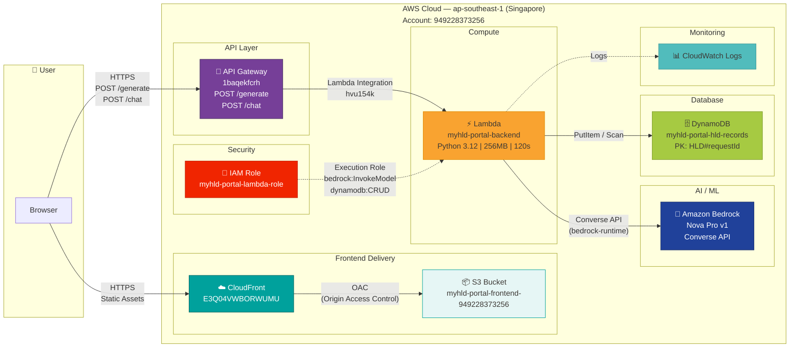

# myHLD Portal — Architecture Diagram

## Flow Summary

| Step | From | To | Protocol | Purpose |
|------|------|----|----------|---------|
| 1 | Browser | CloudFront | HTTPS | Load static frontend (HTML, CSS, JS) |
| 2 | CloudFront | S3 | OAC | Fetch files from private bucket |
| 3 | Browser | API Gateway | HTTPS POST | Send form data or chat message |
| 4 | API Gateway | Lambda | Integration | Route to backend handler |
| 5 | Lambda | Bedrock | Converse API | Generate HLD architecture / chat response |
| 6 | Lambda | DynamoDB | PutItem | Persist HLD records |
| 7 | Lambda | CloudWatch | Logs | Execution logging |

## Two API Routes

| Route | Purpose | Bedrock Usage |
|-------|---------|---------------|
| `POST /generate` | Full HLD generation — Mermaid diagram, TOE table, risk flags, recommendations | Single call, maxTokens: 3000 |
| `POST /chat` | Chatbot assistant — contextual Q&A with form-aware suggestions | Per message, maxTokens: 400 |
